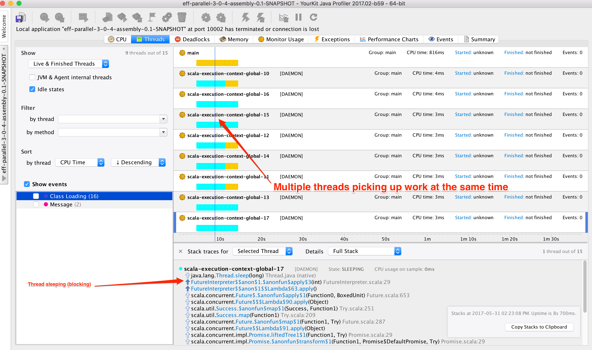

Parallel test for Eff 3.0.4. This project creates a fat jar.

Steps :-
1. Start the sbt script. 
2. Run the `assembly` task which will create a fat jar.
3. Run the jar like java -jar <jarname>
4. Connect any jvm visualizer (YourKit/VisualVM/JConsole) to the program and look at the threads state. We are using `YourKit` here.

This is what we see :-

